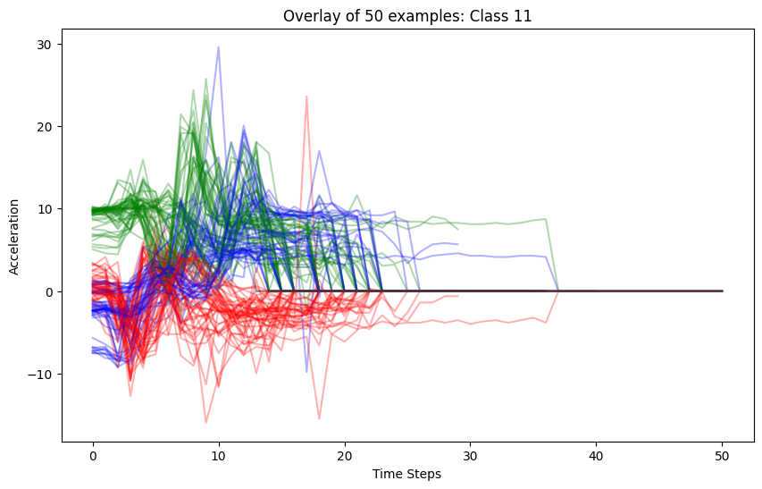

# Gesture Recognition - RNN report

**Steven Bontius**

**April 2026**

## 1. Initial Setup and Data Exploration
The first step in any machine learning case is to understand the raw input. Before building a model, it is essential to ensure reproducibility and conduct a visual inspection of the data.

### Reproducibility
Set global seeds to ensure that results are consistent across runs.
```python
import random
import numpy as np
import torch

def set_seed(seed: int = 42) -> None:
    random.seed(seed)
    np.random.seed(seed)
    torch.manual_seed(seed)
    if torch.backends.mps.is_available():
        torch.mps.manual_seed(seed)
```

### Visual Inspection

Visualizing class 11 50 times yields the following information:



See \ref{fig:gestures}

* **Signal Patterns:** Look for distinct peaks and valleys that characterize different gestures.
* **Duration:** Observe the length of signals to determine necessary padding or windowing.
* **Consistency:** Check if samples within the same class share recognizable temporal signatures.

```python
# Example of plotting a gesture class to inspect patterns
find_and_plot_gesture(train.stream(), target_class=11, num_examples=50)
```

## 2. Baseline Modeling with Early Stopping
Once the data is understood, establish a baseline. A simple architecture (like `BaseRNN`) is preferred initially to test the "learnability" of the dataset.

### Training Configuration
The model should be allowed to run for a high number of epochs (e.g., 100) to ensure the optimization process reaches a stable state. **Early Stopping** is used to monitor validation performance and stop training once the model ceases to improve.

```python
from mltrainer import TrainerSettings

settings = TrainerSettings(
    epochs=100,
    metrics=[accuracy],
    early_stopping=True,
    patience=10, 
)
```

### Sanity Check: Random Guessing
Compare the initial loss to the theoretical loss of random guessing. For a 20-class classification problem, the cross-entropy loss should start around $-\ln(1/20) \approx 2.99$.

## 3. Detecting "Too Good" Performance
A critical checkpoint occurs if the simple baseline model achieves near-perfect results (e.g., $>95\%$ accuracy) almost immediately. 

**Warning:** Performance that is "too good to be true" usually warrants an immediate inspection of the validation strategy. In temporal or user-based datasets, this is a primary indicator of **Data Leakage**.

## 4. Inspection and Resolution: LOSO
If the model performs suspiciously well, it likely means the validation set is not truly independent. For gesture data, windows from the same recording session or user might be present in both training and validation sets.

### Implementing Leave-One-Subject-Out (LOSO)
To validate the model's ability to generalize to new individuals, switch to a LOSO strategy. This involves holding out an entire user's data for testing while training on the rest.

```python
user_ids = ['U01', 'U02', 'U03', 'U04', 'U05', 'U06', 'U07', 'U08']

for user_id in user_ids:
    # Logic to create split where user_id is the hold-out test set
    ...
```

### Findings After Inspection
* **Accuracy Drop:** Typically, accuracy will drop to more realistic levels.
* **High Variance:** Performance may vary significantly depending on which user is held out, indicating that some users have more unique or "difficult" movement patterns.
* **Overfitting Identification:** The gap between training and validation loss often widens, revealing that the initial high performance was due to memorizing specific user traits rather than learning generalizable gesture features.

## Conclusion
A robust workflow requires skepticism toward early success. By starting with visual checks and using a simple model with early stopping, you can identify performance anomalies. Validating against data leakage through strategies like LOSO ensures the model is viable for real-world application.